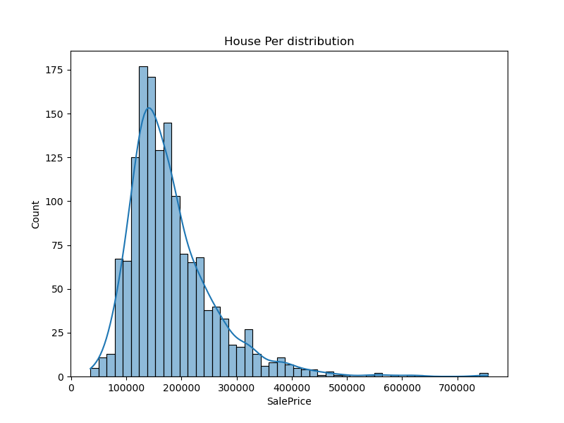
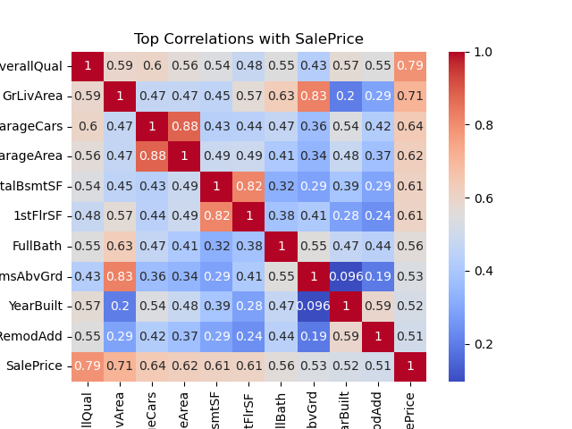
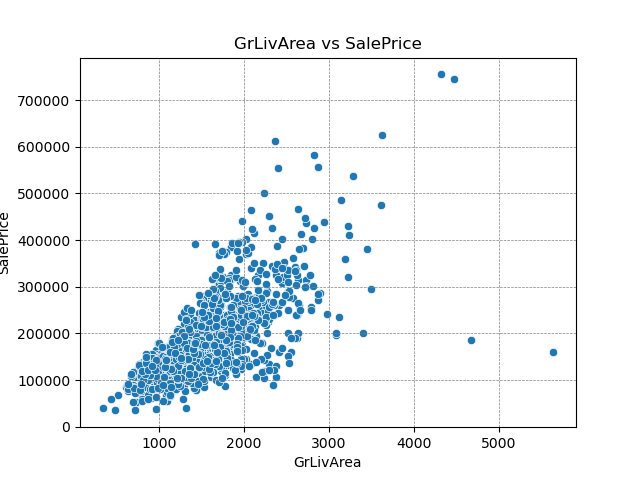
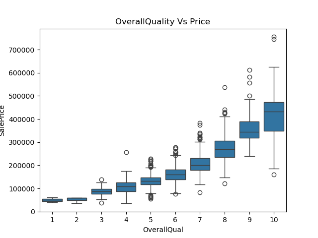

# 🏠 House Price Prediction - Exploratory Data Analysis (EDA)

This project performs exploratory data analysis on the [Kaggle House Prices dataset](https://www.kaggle.com/c/house-prices-advanced-regression-techniques), which contains residential property data from Ames, Iowa.

---

## 📊 Objectives

- Identify key features that influence house prices.
- Handle and visualize missing values.
- Explore relationships between variables and `SalePrice`.

---

## 🗂️ Files

- `House_price_EDA.ipynb`: Jupyter notebook with complete EDA.
- `/images`: Folder with plots saved from the notebook.
- `train.csv` and `test.csv`: Dataset files (must be downloaded from Kaggle).

---

## 🛠️ Tools Used

- Python
- Pandas
- Seaborn
- Matplotlib
- NumPy
- Jupyter Notebook

---

## 🔍 Key Insights

- `SalePrice` is **right-skewed** — log transformation may help modeling.
- Features like `OverallQual`, `GrLivArea`, and `Neighborhood` show strong correlation with price.
- Missing values were imputed with **mode** (for categorical) and **median** (for numerical).

---

## 📈 Visualizations

### 📊 SalePrice Distribution

### 🔥 Top Correlated Features

### 🏡 GrLivArea vs SalePrice

### 📦 OverallQual vs SalePrice

---

## ▶️ Usage

Open `House_price_EDA.ipynb` in Jupyter Notebook or any notebook viewer to explore the analysis.

Make sure you have `train.csv` and `test.csv` from [Kaggle](https://www.kaggle.com/c/house-prices-advanced-regression-techniques/data) in the same folder.

---

## 🧠 Author

Made by [pritam1952](https://github.com/pritam1952) — learning Data Science one project at a time 🚀
